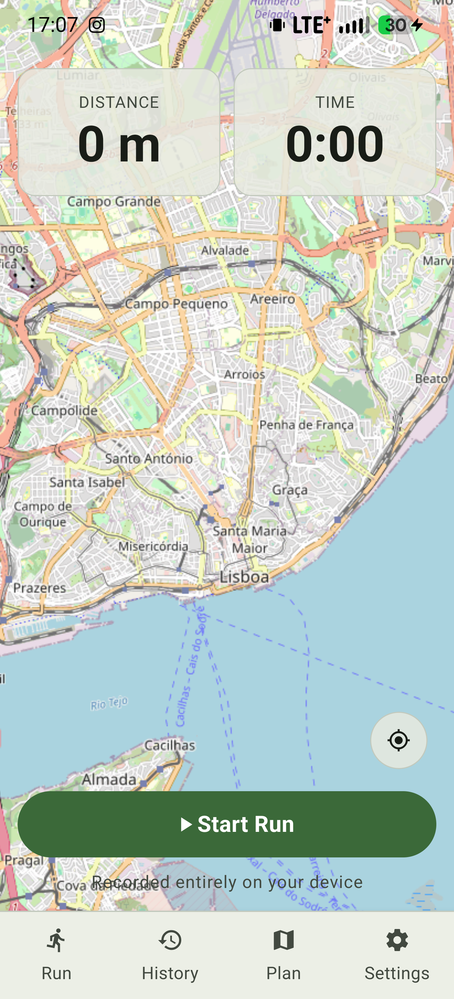
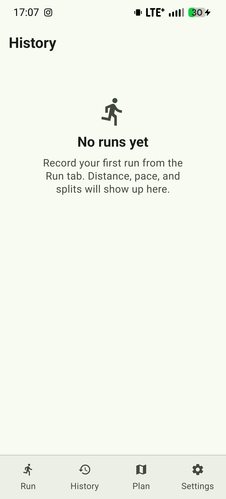
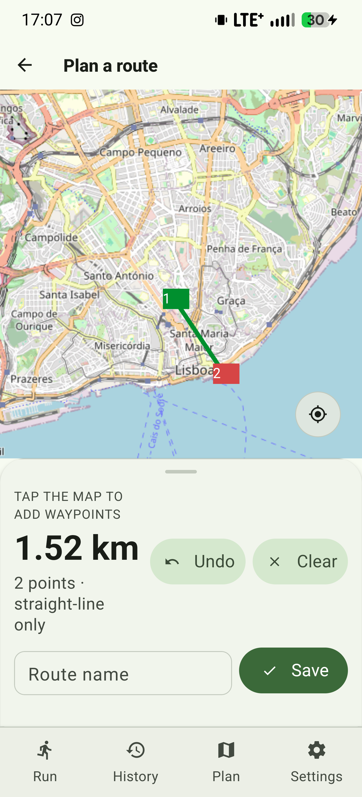
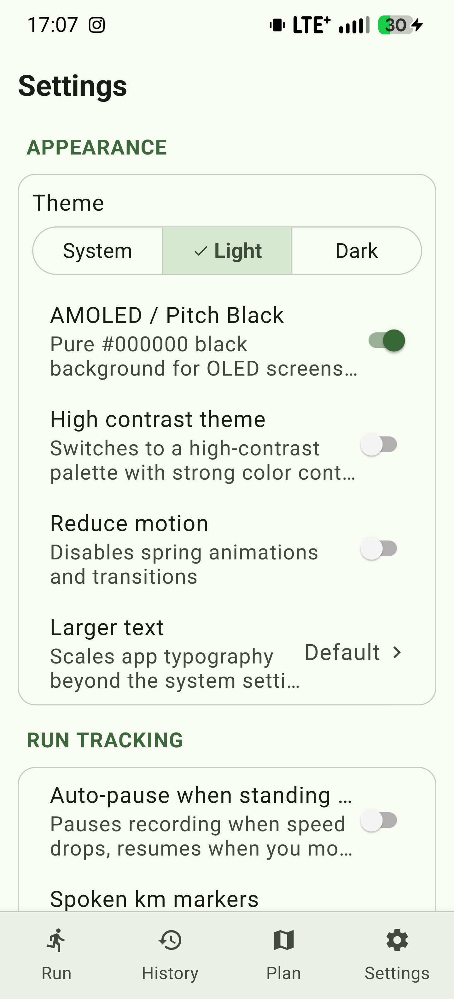
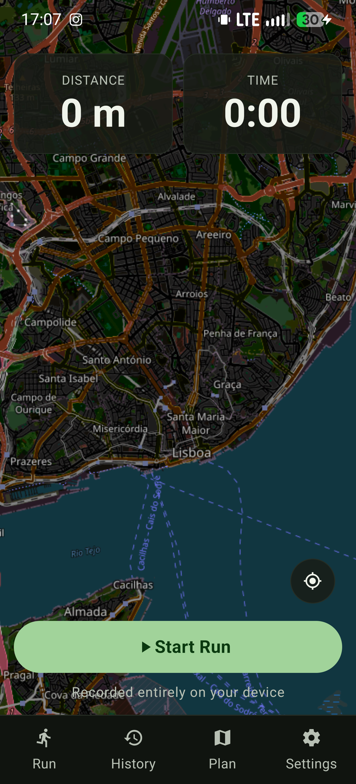
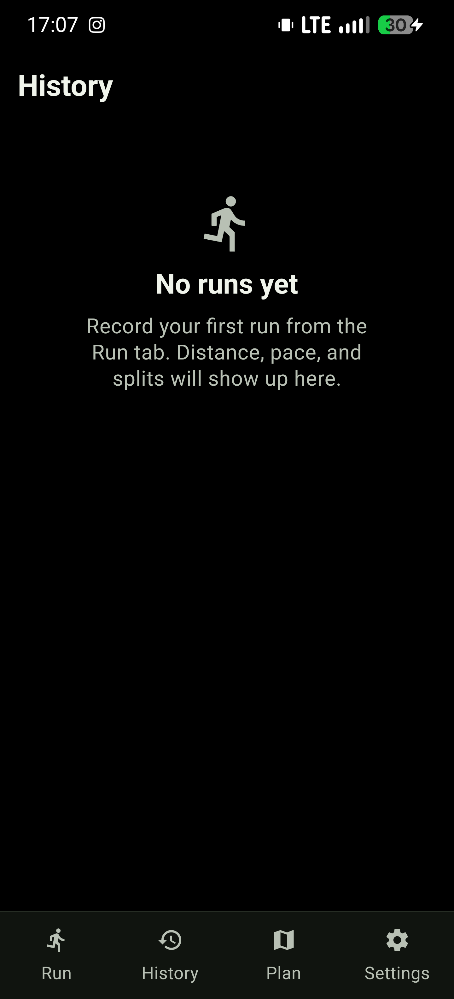
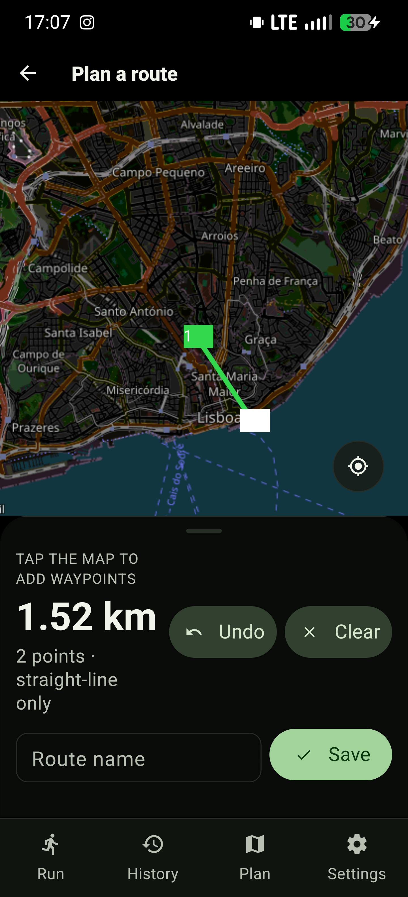
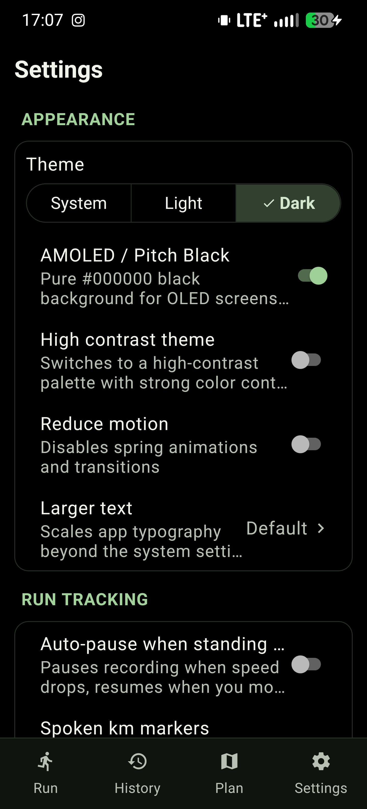

# RunTracker 🏃‍♂️💨

<div align="center">


-61DAFB?style=for-the-badge&logo=react&logoColor=black)


**An ultra-responsive, privacy-first running companion and route planner for Android.**  
*Zero cloud dependencies, zero telemetry, zero analytics. Everything is recorded and processed 100% on your device.*

[Features](#-key-features) • [Design System](#-material-design-3-system) • [Architecture](#-architecture--engine) • [Getting Started](#-getting-started) • [Release Build](#-production-release-build) • [Privacy & Permissions](#-permissions--privacy)

</div>

---

## 📱 App Showcase

### ☀️ Light Theme (Material Design 3)

<div align="center">

| Run & Live GPS | Activity History & Streaks | Route Planning & Waypoints | Settings & Theming |
|:---:|:---:|:---:|:---:|
|  |  |  |  |
| *Real-time GPS HUD & Map* | *Weekly Goals & Streak Rings* | *Interactive Vector Waypoints* | *MD3 Theme & Accessibility* |

</div>

### 🌙 Dark Theme (Material Design 3 & AMOLED Pitch Black)

<div align="center">

| Run & Live GPS | Activity History & Streaks | Route Planning & Waypoints | Settings & Theming |
|:---:|:---:|:---:|:---:|
|  |  |  |  |
| *True OLED Pitch Black HUD* | *Pure #000000 Timeline* | *Dark Vector Waypoint Routing* | *AMOLED & Contrast Controls* |

</div>

---

## 🌟 Key Features

### 📍 Precision Run Recording
- **Real-Time GPS Engine**: Full-screen interactive map powered by Leaflet & OpenStreetMap tiles with automatic day/night theme matching.
- **Smart Auto-Pause**: Automatically pauses tracking when stationary (e.g. at traffic lights) and resumes smoothly when motion is detected.
- **Kilometer Voice Announcements & Audio Cues**: Spoken split times, distances, and haptic beeps at every kilometer marker.
- **On-Demand Stats Readout**: Dedicated audio cue button announces live metrics (distance, elapsed time, current pace, paused duration) into your headphones.
- **Crash-Proof State Machine**: Continuous state checkpointing to local SQLite every 15 seconds. If the OS terminates the app, you can seamlessly resume your session on restart.
- **Lock-Screen Foreground Service**: Persistent Android notification with real-time distance, time, and pace updates even when the screen is locked.

### 🗺️ Route Planner & Waypoints
- **Interactive Waypoint Creator**: Create custom running routes by tapping waypoints directly on the vector map with instant straight-line distance calculations.
- **Route Library**: Save, name, review, and export planned routes.
- **Guide Line Overlay**: Load a planned route into an active run session to display a dashed target trail on your live map.

### 📊 History, Analytics & Goals
- **Activity Metrics**: Comprehensive summaries with total distance, elapsed time, moving pace, and split breakdowns.
- **Progress Visualizations**: Animated SVG progress rings tracking weekly distance goals (30 km baseline) and consecutive running streaks.
- **GPX Data Export**: Export standard `.gpx` files for any run to share or import into external analysis tools.

### 🔒 100% Offline-First & Data Sovereignty
- **Zero Cloud Accounts**: No logins, no tracking SDKs, no external telemetry.
- **Full Backup & Restore**: One-click `.zip` archive creation bundling `data.json` and individual `.gpx` tracks.
- **Conflict Management**: Import options with `Skip duplicates`, `Replace existing`, or `Keep both`.

### ♿ Accessibility & Inclusivity (WCAG 2.2 AA)
- **Large Touch Targets**: Minimum 48dp (primary actions 60dp+) interactive touch targets.
- **Material 3 Dynamic Theming**: Supports Light, Dark (M3 Charcoal), AMOLED Pitch Black (`#000000`), System, and High-Contrast palettes.
- **Font & Display Scaling**: Integrated text scaling multiplier (100% to 150%) with dynamic wrapping and truncation protection.
- **Reduce Motion Support**: Cleanly toggles spring physics and transitions for users sensitive to motion.

---

## 🎨 Material Design 3 System

RunTracker implements Google's **Material Design 3 (M3 Expressive)** design specification:

```
┌────────────────────────────────────────────────────────┐
│               M3 Expressive Theme System               │
├────────────────────────────────────────────────────────┤
│  • Surface Container Hierarchy (Lowest → Highest)      │
│  • Primary / Secondary / Tertiary / Error Containers   │
│  • Light, Dark, AMOLED Pitch Black & High-Contrast     │
│  • Physics-Based Springs (spatialFast, spatialDefault) │
│  • 7-Shape Parametric Morphing Loading Indicators      │
│  • Synchronized Content-Fidelity Shimmer Skeletons     │
└────────────────────────────────────────────────────────┘
```

- **Surface Tones**: Uses layered surface containers (`surfaceContainerLowest`, `surfaceContainerLow`, `surfaceContainer`, `surfaceContainerHigh`, `surfaceContainerHighest`) to establish clear elevation and depth without noisy drop-shadows.
- **Fluid Micro-Interactions**: Custom `useM3PressScale` hook applies subtle spring physics (`spatialFast`) on touch down/up.
- **Parametric Loading Indicator**: A continuous 7-shape morphing loader (circle → rounded square → square → triangle → diamond → horizontal bar → circle) running entirely on the UI thread via Reanimated worklets.

---

## ⚡ Architecture & Engine

```
src/
├── components/       # Reusable M3 UI (BigButton, Card, Dialog, Skeleton, ProgressRing, MapWebView)
├── db/               # High-performance SQLite engine (indices, transactions, migrations)
├── hooks/            # Motion and interaction hooks (useM3PressScale, useTheme)
├── lib/              # Zero-allocation geo math (haversine, speed, pace, streaks)
├── map/              # Generated offline-ready Leaflet runtime bridge
├── navigation/       # React Navigation 7 tabs and native stacks
├── screens/          # Main application screens (Run, History, Plan, Settings, Details)
├── services/         # RunSession state machine, notifications, audio cues, backup
├── theme/            # M3 color tokens, typography scales, contrast palettes
└── types.ts          # Strongly typed application models
```

### High-Performance Optimizations
1. **$O(1)$ Distance Accumulation**: Real-time distance tracking updates incrementally on each GPS coordinate fix rather than recalculating previous segments in $O(N)$ loops.
2. **Precomputed Geo Trigonometry**: Fast Haversine calculations using precomputed constants (`DEG_TO_RAD`, `2 * R_EARTH`) and zero-allocation sliding-window speed buffers.
3. **Database Performance**: SQLite indexes on `idx_runs_start_time` and `idx_routes_created_at`, point lookups (`getRun`, `getRoute`), and batch transactions.
4. **Virtualization & Memoization**: FlatList performance props (`removeClippedSubviews`, `maxToRenderPerBatch`, `windowSize`) paired with memoized card renderers.
5. **Background Tab Pre-Rendering**: Non-blocking background tab mounting (`lazy: false`) ensures 60 FPS transitions when switching screens.

---

## 🛠️ Tech Stack

| Component | Technology | Version | Purpose |
|---|---|---|---|
| **Core Framework** | React Native | `0.86.2` | Mobile runtime |
| **Language** | TypeScript | `^5.8.3` | Type safety and domain models |
| **UI Components** | React Native Paper | `^5.15.3` | Material Design 3 primitives |
| **Animations** | React Native Reanimated | `^4.5.3` | UI-thread 60 FPS animations |
| **Navigation** | React Navigation | `^7.18.15` | Tab and native stack routing |
| **Database** | `expo-sqlite` | `^57.0.1` | Embedded SQLite engine |
| **GPS & Location** | `expo-location` | `^57.0.8` | High-accuracy GPS streaming |
| **Map Rendering** | `react-native-webview` + Leaflet | `^14.0.1` | Local vector map rendering |
| **Audio & Speech** | `expo-speech` + `expo-audio` | `^57.0.1` | Voice splits & feedback beeps |
| **Notifications** | `expo-notifications` + Native Kotlin Service | `^57.0.9` | Reminders & lock-screen stats |
| **Archive / Backup** | `react-native-zip-archive` | `^9.0.2` | GPX/JSON `.zip` backup exporter |

---

## 🚀 Getting Started

### Prerequisites
- **Node.js**: `20.x` or `22.x`
- **JDK**: Java Development Kit `17`
- **Android SDK**: Build Tools `34.0.0` or newer
- **Android Device / Emulator**: Running Android 10+ (API Level 29+)

### Installation

1. **Clone the repository**:
   ```bash
   git clone https://github.com/jlfernandes22/RunTracker.git
   cd RunTracker/RunTracker
   ```

2. **Install dependencies**:
   ```bash
   npm install
   ```

3. **Start the Metro Bundler**:
   ```bash
   npm start
   ```

4. **Run on Android (Debug)**:
   ```bash
   # In a separate terminal
   npx react-native run-android
   ```

   *If testing on a physical device over USB:*
   ```bash
   adb reverse tcp:8081 tcp:8081
   ```

---

## 📦 Production Release Build

To build and install the standalone, optimized production release APK:

### 1. Assemble Release APK
```bash
cd android
./gradlew assembleRelease
```

The release APK will be generated at:
```
android/app/build/outputs/apk/release/app-release.apk
```

### 2. Install on Device via ADB
```bash
adb install -r app/build/outputs/apk/release/app-release.apk
```

---

## 🧪 Testing & Verification

RunTracker includes comprehensive unit tests for core geospatial algorithms:

```bash
# Run unit tests
npm test

# Run ESLint validation
npm run lint

# Run TypeScript static analysis
npx tsc --noEmit
```

---

## 🔐 Permissions & Privacy

RunTracker requires minimal permissions to provide offline tracking features:

| Permission | Scope | Purpose |
|---|---|---|
| `ACCESS_FINE_LOCATION` | Foreground / Service | GPS run recording and live location centering |
| `ACCESS_COARSE_LOCATION` | Foreground | Approximate positioning fallback |
| `FOREGROUND_SERVICE` | Background Service | Keeping GPS recording alive while device is locked |
| `FOREGROUND_SERVICE_LOCATION` | Android 14+ | Declared location foreground service type |
| `POST_NOTIFICATIONS` | Android 13+ | Spoken reminders and live lock-screen metrics HUD |
| `SCHEDULE_EXACT_ALARM` | Alarms | Punctual weekly run reminder triggers |
| `RECEIVE_BOOT_COMPLETED` | System | Re-scheduling reminder alarms after device reboot |
| `VIBRATE` | Hardware | Haptic feedback for button presses and split milestones |

> **Privacy Guarantee**: All location points, route waypoints, run histories, and personal settings are strictly stored in your local SQLite database (`runtracker.db`). No telemetry, analytics, or coordinates are ever transmitted over the network.

---

## 📄 License

This project is open source and available under the [MIT License](LICENSE).
