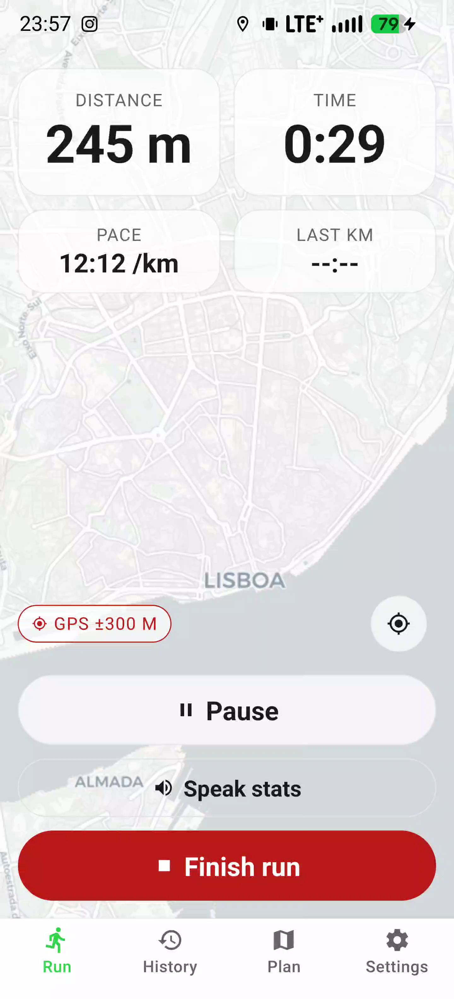
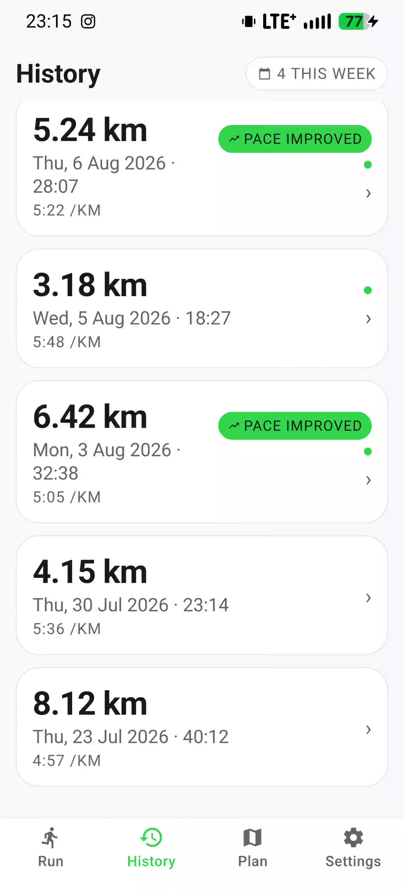
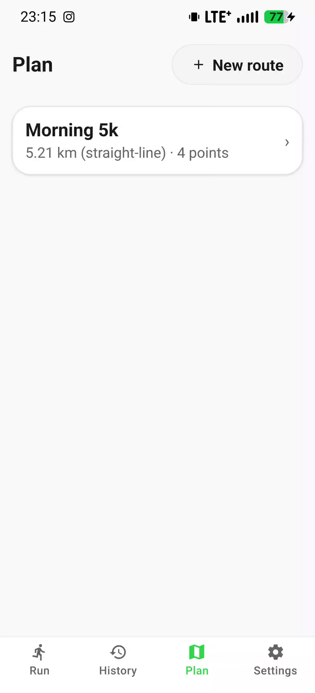

# RunTracker

**Offline-first running companion for Android.** GPS run recording, route planning, history with stats, and motivational reminders — 100% on-device. No account, no cloud, no tracking. All data stays on your phone.

  

---

## Features

### Run recording
- Live GPS tracking with a full-screen map (OpenStreetMap, dark/light themes)
- Start / pause / resume / finish with large touch targets (48dp+)
- **Auto-pause**: pauses when you stop moving, resumes when you speed up
- **Km markers**: beep + haptic + spoken announcement every kilometer
- Live stats on the lock screen while running (Android foreground service)
- Speak-stats on demand (announces distance, time, pace, paused time)
- Crash recovery: a checkpoint is saved every 15 s, with a resume/discard prompt on next launch
- GPS accuracy indicator (good / fair / weak)

### History & stats
- Run list with distance, duration, pace, and "pace improved" badges
- Per-run detail: polyline map, full route summary (text + spoken), point-by-point text list
- Weekly distance widget (30 km goal), current streak (days), runs-this-week chip
- Notes per run, GPX export, "Save as planned route"

### Route planning
- Plan a route by tapping waypoints on the map (numbered markers, undo/clear)
- Straight-line distance (no time estimate)
- Saved route list, route detail, "Start run with this route" (dashed planned line on the live map)

### Reminders (local notifications)
- Weekly schedule: presets (Every day / Weekdays / Weekends) or custom day chips
- Time picker with hour/minute steppers (hold to scroll, 5-minute steps)
- Rest-day nudges on non-run days

### Backup & restore
- Export a zip backup: `data.json` + one GPX per run
- Import with duplicate handling: Skip duplicates / Replace existing / Keep both
- Everything stays on the device — nothing is uploaded

### Accessibility (WCAG 2.2 AA principles)
- 48dp+ touch targets, high-contrast theme, reduce-motion option
- In-app text scaling (110–150%) beyond the system setting
- Screen-reader-friendly: roles, labels, hints, `maxFontSizeMultiplier` on all text
- Spoken summaries instead of visual-only content

---

## Tech stack

| Layer | Choice |
| --- | --- |
| Framework | React Native 0.86 (React 19, TypeScript) |
| Navigation | React Navigation 7 (bottom tabs + native stacks) |
| Maps | Leaflet 1.9 in a WebView (react-native-webview), OSM tiles |
| Database | expo-sqlite (SQLite, local) |
| Notifications | expo-notifications (weekly triggers) + native foreground service for lock-screen stats |
| Location | expo-location (high accuracy watch) |
| Audio / speech | expo-audio (beeps) + expo-speech (km announcements) |
| Files / backup | expo-file-system + expo-document-picker + react-native-zip-archive |
| Icons / UI | react-native-vector-icons (Material), react-native-svg (progress rings) |
| Gestures | react-native-gesture-handler (map-in-scroll gesture ownership) |

All runtime dependencies are actively maintained (verified against npm publish dates).

---

## Getting started

### Prerequisites
- Node.js 20+
- JDK 17+
- Android Studio / Android SDK (API 34+)
- A device or emulator running Android 10+ (the lock-screen stats feature targets Android 10+)

### Install

```bash
npm install
```

### Run (debug)

```bash
npm start            # Metro bundler
# in a second terminal:
npx react-native run-android
```

The app loads its JS bundle from Metro. On a physical device:

```bash
adb reverse tcp:8081 tcp:8081
```

### Release build

```bash
cd android
./gradlew assembleRelease
adb install -r app/build/outputs/apk/release/app-release.apk
```

### Tests

```bash
npm test             # unit tests (lib/geo)
npm run lint         # eslint
npx tsc --noEmit     # type check
```

---

## Permissions

Declared in `android/app/src/main/AndroidManifest.xml`:

| Permission | Why |
| --- | --- |
| `ACCESS_FINE_LOCATION` / `ACCESS_COARSE_LOCATION` | Recording runs and showing your position |
| `POST_NOTIFICATIONS` | Run reminders and lock-screen stats |
| `FOREGROUND_SERVICE` / `FOREGROUND_SERVICE_LOCATION` | Keeping the session alive with the screen locked |
| `SCHEDULE_EXACT_ALARM` | Punctual weekly reminder notifications |
| `RECEIVE_BOOT_COMPLETED` | Re-scheduling reminders after reboot |
| `VIBRATE` | Haptic run cues |

Location is used only while a run is active and is never transmitted anywhere.

---

## Architecture

```
src/
├── components/     Reusable UI (buttons, dialogs, map, reminder picker, rings…)
├── db/             expo-sqlite layer (schema, typed queries, dead-handle recovery)
├── lib/            Pure logic: geo math (haversine, pace, streaks), formatting
├── map/            Generated Leaflet page (scripts/gen-map-html.js → mapHtml.ts)
├── navigation/     Tabs + stacks (Run / History / Plan / Settings)
├── screens/        Screens (run, history, detail, planner, settings, onboarding)
├── services/       RunSession (state machine), notifications, audio cues, backup
├── theme/          Palettes (light/dark/high-contrast), typography, settings
└── types.ts        Shared types
```

### RunSession
The recording state machine lives in `src/services/RunSession.ts` (a singleton). It owns the GPS watch, elapsed/paused accounting, auto-pause logic, km boundaries, checkpoints, the foreground service, and the live snapshot emitted to the UI.

### The map
`src/components/MapWebView.tsx` hosts a Leaflet page (`src/map/mapHtml.ts`, generated from `scripts/map-page.html`). Modes: **plan** (numbered waypoint markers, tap-to-add) and **track** (live line + position dot). On detail screens the map is pinned below the scrollable content so pan/pinch gestures aren't stolen by the page scroll.

### Notifications
Weekly reminders are scheduled with expo-notifications (`WEEKLY` triggers). The lock-screen run stats are posted by a small native foreground service (`android/.../RunStatsService.kt`) — expo-notifications can't set per-notification lock-screen visibility, so the service owns that channel (DEFAULT importance + PUBLIC visibility).

---

## Project history / roadmap status

- Sprints 1–7: run recording, history & stats, route planning, reminders, backup/restore, accessibility, theme polish — implemented.
- The codebase was migrated off unmaintained libraries (notifee, react-native-sqlite-storage, react-native-fs, react-native-tts, react-native-sound, react-native-document-picker, react-native-geolocation-service, react-native-background-actions) onto their maintained expo equivalents.

---

## License

Private project. All rights reserved.
